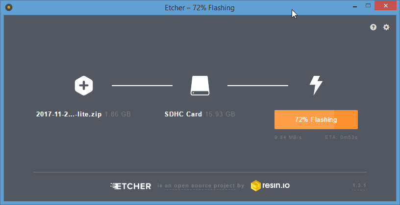

## Installation

- Etcher 1.3.1 on Windows 
- Raspbian Stretch Lite

Download [Raspbian Stretch Lite image](https://www.raspberrypi.org/downloads/raspbian/) and flash that to your Micro SD cards for your Raspberry Pi with [Etcher](https://etcher.io/).

## Post Configuration

Default login is

- User: pi
- Password: raspberry

1. Change password with `passwd` and set password for `root` with `sudo passwd`.
2. Run `sudo raspi-config`
 - Setup localization (keyboard, timezone, WIFI country), default is GB
 - Setup networking (hostname, WIFI)
 - Enable SSH server for remote access
 - Since no GUI is used change GPU memory to lowest 16MB value
 - Expand filesystem to use whole card
 - reboot
 
